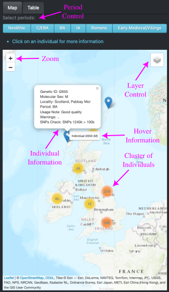
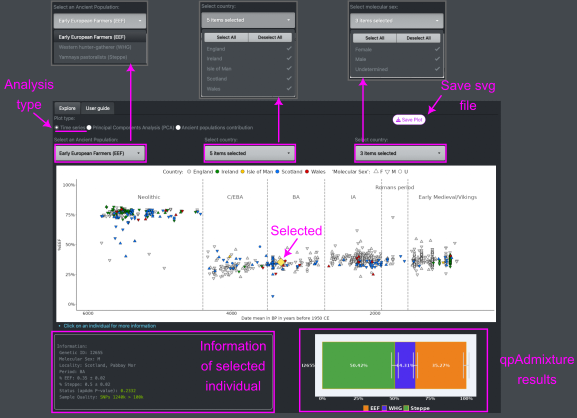
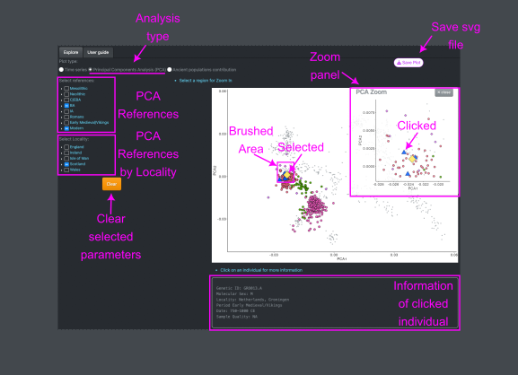
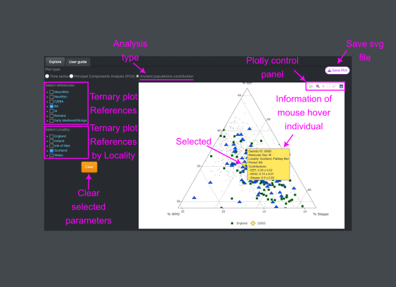

### Introduction

Ancient DNA (aDNA) has revolutionised our understanding of human history, revealing details about population movements and interactions. The [COMMIOS project](https://commiosarchaeology.wordpress.com/) integrates biomolecular and archaeological approaches to provide a holistic view of Iron Age communities in Britain within a European context. To date, over 1,000 individuals have been sequenced to investigate the mobility and kinship of ancient populations and their relation to modern populations. To manage and disseminate these data, we are developing the **COMMIOS web application**, which:

  - Enable the exploration of genetic data alongside archaeological findings
  - Facilitate comparative analyses between ancient and modern populations
  - Offer tools for analysing genetic diversity and population structure
  - Promote data sharing and collaborative research.

### Data

All data used by this application were either produced by **[COMMIOS team](https://commiosarchaeology.wordpress.com/people/)** or are available from the **Allen Ancient DNA Resource (AADR) v54.1.p1** [Mallick et al., 2024][1]. The table containing information on all the individuals used in this web application can be downloaded from [GitHub](https://github.com/sebametz/COMMIOS_app). For more information about the meaning of the different columns, follow this [link](./other/helpTable.md). We have restricted the analyses to UK and Ireland ancient individuals from the Neolithic to the Medieval period (~6000 - ~850 mean BP in years before 1950 CE), with the periods defined as in [Patterson et al., (2022)][2]

### Application usage

The application basically has three main inputs: a map, a table and a Time Series plot of ancient population contributions to each individual. To explore any individual click on it in either the map, the table or the Time Series.

The map shows all the ancient individuals from Britain and Ireland collected from **AADR v54.1.p1**. The Time Series shows the contributions of ancient populations, calculated using an admixture model (EEF + WHG + Yamnaya) with qpAdmixture ([Patterson et al., 2012][3], [Maier & Patterson, 2024][4]).

The map and Time Series inputs are responsive to each other. When you click on an individual on the map, the Time Series will automatically highlight that individual. Similarly, when you click on a point in the Time Series, the map will automatically zoom in on that individual’s location. A similar reaction will occur if you click on an individual in the table, it will be updated in the map and Time Series plot, except that the table will not be updated when the individual is selected in the map or Time Series. To do it filter the individual using the Genetic ID.

Plots specific to selected individual will be rendered automatically. Several analyses and pieces of information are available, and the outputs will automatically update whenever the user adjusts one of the input widgets.

### Map elements

The individuals on the map are clustered together for better visualisation, as one site can have many individuals. When you hover over an individual, the Genetic ID and sex (M: Male, F: Female, and U: Unknown) will be displayed. If an individual is clicked, more information will pop up. 

Various topographic and satellite base layers are available. To activate any of these layers, hover the mouse over the layers control box (top right of the map) and select one. To filter individuals from specific periods, select the desired period in the top checkbox widget. To zoom in / out use the zoom control box (top left of the map). 

<figure align="center">
  
</figure>

### Time series

Three filtering and parameter options were implemented for the Time Series plot.

 - Ancient Populations contribution (Y-Axis): Users can choose the Y-axis to display the contributions of individuals from Early European Farmers (EEF), Western Hunter-Gatherers (WHG), and Yamnaya pastoralists (Steppe).
 - Country of Origin: Individuals can be filtered by their modern country of origin, with each country represented by the colour in the plot. 
 - 'Molecular Sex': Individuals can also be filtered by their assigned 'molecular sex'-Female, Male, or Undetermined—represented by the shapes in the plot.

When an individual is clicked, detailed information is displayed at the bottom of the screen. The Status Information, includes the P-value of the admixture model. If the P-value is lower than 0.01, an alert will notify you. The Sample Quality provides details such as the number of SNPs and the presence of any contamination. A minimum of 25k SNPs is recommended for quality samples; samples with fewer SNPs are considered low quality. The detailed information can be filtered in the table.

The qpAdmixture plot can be viewed at the bottom right, showing the percentage contribution of each ancient population to the selected individual.

<figure align="center">
  
</figure>

## Principal Components Analysis (PCA)

To generate a PCA, select the option from the Plot Type selector at the top. The selected individual will be highlighted with a yellow diamond on the plot. To explore the similarity between this individual and a reference group, choose the desired group from the References selection panel, which will then be added to the PCA. Western European modern individuals are displayed in grey. For comparisons with individuals from other locations, use the PCA References by Locality panel, which allows you to highlight any selected individual as a blue triangle on the plot.

If you want to zoom in on a specific region, simply select the area, and a new panel will pop up displaying the zoomed-in section of the plot. This panel can be closed by clicking the close button. For further interactivity, clicking on individuals in the PCA will provide more detailed information. If you wish to reset the plot to its original state, simply click the Clear button.

<figure align="center">
  
</figure>

## Ancient contribution (Ternary plot)

The Ancient Contribution or Ternary plot provides another way to explore the contributions of ancient populations to a selected individual or a group of reference individuals chosen from the selection panel. Hover on an individual in the plot will display detailed information. 

<figure align="center">
  
</figure>

## Table

The table contains all the individuals from the COMMIOS project and the AADR v54.1.p1 that are from Britain and Ireland and appear on the map. For a complete table with all reference individuals and information about the admixture models and PCA, download it from [GitHub](https://github.com/sebametz/COMMIOS_app).

### Contact
If you would like to collaborate or have any suggestion/request, please contact me:

- Sebastian Metz sebastian.metz[at]york.ac.uk

[1]: <https://doi.org/10.1038/s41597-024-03031-7> "Mallick, S., Micco, A., Mah, M. et al. The Allen Ancient DNA Resource (AADR) a curated compendium of ancient human genomes. Sci Data 11, 182 (2024)."

[2]: <https://doi.org/10.1038/s41586-021-04287-4> "Patterson, N., Isakov, M., Booth, T. et al. Large-scale migration into Britain during the Middle to Late Bronze Age. Nature 601, 588–594 (2022)."

[3]: <https://doi.org/10.1534/genetics.112.145037> "Patterson N, Moorjani P, Luo Y, Mallick S, Rohland N, Zhan Y, Genschoreck T, Webster T, Reich D. Ancient admixture in human history. Genetics. Nov;192(3):1065-93 (2012)."

[4]: <https://github.com/uqrmaie1/admixtools> "Maier, R. and Patterson, N. admixtools: Inferring demographic history from genetic data (2024)"